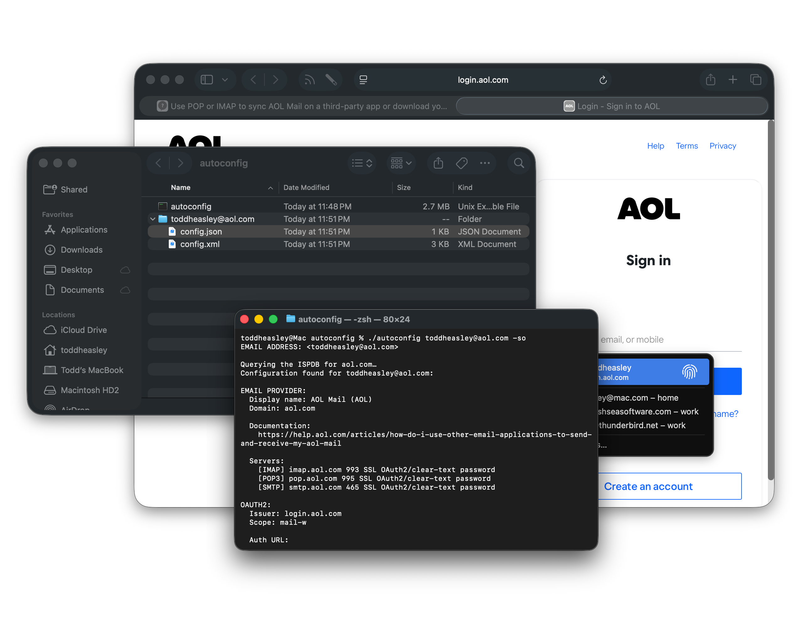

# Feature Libraries

## `Autoconfiguration`

[Thunderbird Autoconfiguration](https://www.bucksch.org/1/projects/thunderbird/autoconfiguration), often just "autoconfig," is an XML syndication format where email service providers advertise public mail server settings.

### Library

`Autoconfigruation` library attempts to return a mail server configuration for any email address, preferring configurations from the provider domain, then falling back on our own [Thunderbird autoconfig database.](https://github.com/thunderbird/autoconfig)

The complete autoconfig schema is implemented, including OAuth and web mail extensions. All sources are queried. Support for email addresses using custom domains is planned, but not yet implemented.

For addresses not listed in the ISPDB, `Autoconfiguration` queries the email provider directly.

```swift
import Autoconfiguration
import Foundation

let example: (config: ClientConfig, source: Source) = try await URLSession.shared.autoconfig("toddheasley@aol.com")
```

Local configurations for custom domains and [MDM](https://support.apple.com/guide/deployment/welcome/web) are not supported yet.

### Command-line interface

`autoconfig` is a bundled CLI demo of `Autoconfiguration` library:

```zsh
./autoconfig toddheasley@aol.com -so
```

Email address is a required argument, plus two flags:

* `--save`: Save original config XML and JSON files to app working directory.
* `--open`: Open all config URLs in a browser; if saving, show files in Finder.



## `JMAP`

[JSON Meta Application Protocol](https://jmap.io) (JMAP)) is a modern, API-based approach to email that uses standard HTTP requests and responses with JSON serialization for transit.

`JMAP` feature library is a _client_ implementation of both [JMAP core](https://jmap.io/spec-core.html) and [JMAP mail](https://jmap.io/spec-mail.html) protocols, with functionality tailored for use in [Thunderbird for iOS.](https://github.com/thunderbird/thunderbird-ios)
